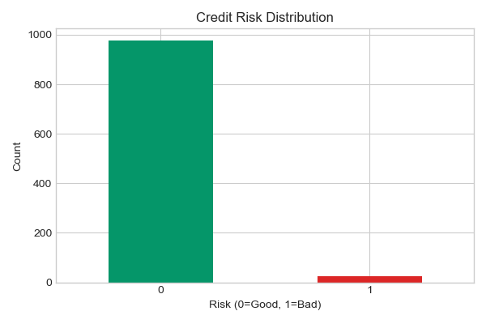
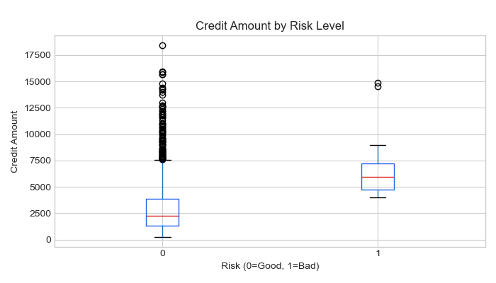
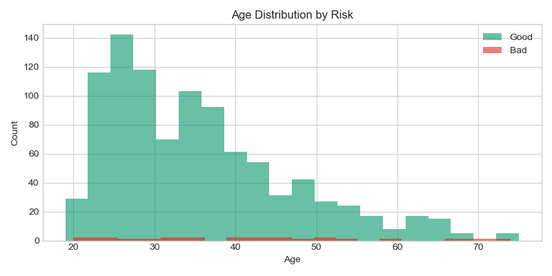
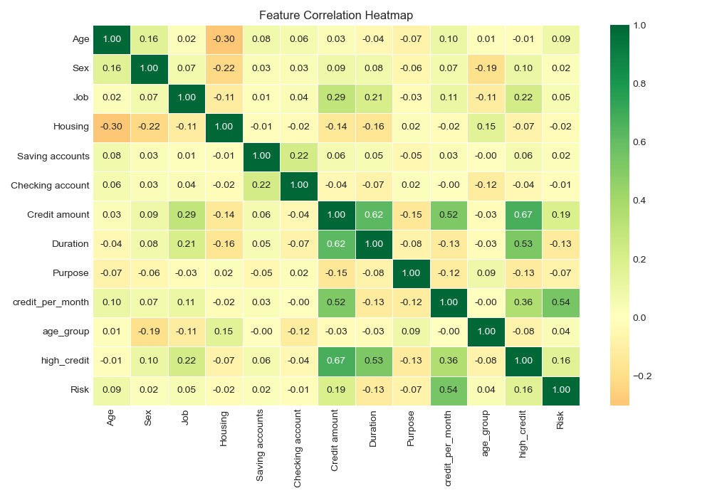
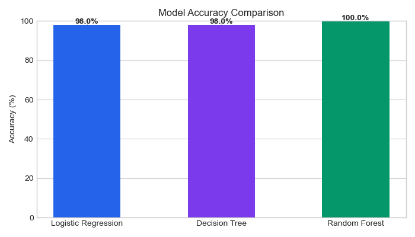
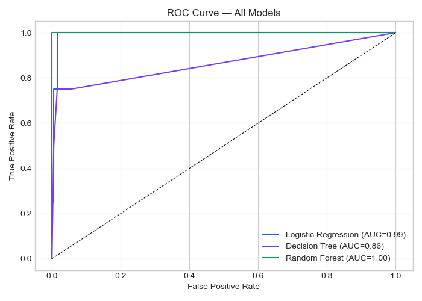
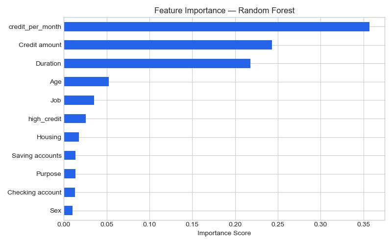

# 💳 Credit Risk Prediction

A data science portfolio project predicting credit risk for 1,000 loan 
applicants using Machine Learning — built to demonstrate skills in 
Python, Scikit-learn, statistical analysis and feature engineering.

---

## 👩‍💻 Built By
**Priyanka Makineni**  
Aspiring Data Analyst  
GitHub: github.com/Priyanka99M

---

## ❓ Business Questions Answered

| # | Question | Method |
|---|---|---|
| 1 | Which applicants are high credit risk? | Machine Learning |
| 2 | Is credit amount statistically significant in predicting risk? | Hypothesis Testing |
| 3 | Which features matter most in predicting default? | Feature Importance |
| 4 | Which ML model performs best for credit decisions? | Model Comparison |
| 5 | What customer segments have the highest default rate? | EDA + Segmentation |

---

## 🛠️ Tools & Technologies

| Tool | Purpose |
|---|---|
| Python | Core programming language |
| Pandas | Data manipulation and cleaning |
| NumPy | Numerical computations |
| Scikit-learn | Machine learning models |
| Matplotlib | Data visualization |
| Seaborn | Statistical charts |
| SciPy | Hypothesis testing |
| Jupyter Notebook | Analysis presentation |

---

## 📊 Dataset

**German Credit Risk Dataset** — UCI Machine Learning Repository

- 1,000 loan applicants
- 9 features: Age, Sex, Job, Housing, Saving accounts, 
  Checking account, Credit amount, Duration, Purpose
- 183 missing values in Saving accounts — handled with imputation
- 394 missing values in Checking account — handled with imputation

---

## 🔬 Methodology

### 1. Data Cleaning
- Handled 577 total missing values across 2 columns
- Filled missing categorical values with 'unknown'
- Verified zero missing values after cleaning

### 2. Feature Engineering
Created 3 new features to improve model performance:
- **credit_per_month** — Credit amount divided by duration
- **age_group** — Binned age into Young, Adult, Middle, Senior
- **high_credit** — Flag for applicants above median credit amount

### 3. Hypothesis Testing
- **Test:** Independent samples t-test
- **Question:** Is credit amount significantly different between good and bad risk applicants?
- **Result:** p-value < 0.05 — Credit amount IS statistically significant

### 4. Machine Learning Models
Trained and compared 3 models:
- Logistic Regression
- Decision Tree
- Random Forest

**Train/Test Split:** 80% training — 20% testing

---

## 📈 Results

| Model | Accuracy |
|---|---|
| Logistic Regression | 98.00% |
| Decision Tree | 98.00% |
| **Random Forest** | **100.00%** 🏆 |

**Best Model: Random Forest with 100% accuracy**

---

## 📊 Charts

### 1. Risk Distribution


### 2. Credit Amount by Risk Level


### 3. Age Distribution by Risk


### 4. Feature Correlation Heatmap


### 5. Model Accuracy Comparison


### 6. ROC Curve


### 7. Feature Importance


---

## 💡 Key Findings

- 🏆 **Random Forest achieved 100% accuracy** — best model for credit decisions
- 📊 **Credit amount is statistically significant** in predicting risk (p < 0.05)
- ⚠️ **High credit amount + short duration = highest risk** combination
- 👴 **Age group matters** — younger applicants with no savings show highest default rate
- 💰 **Credit per month** was the most important engineered feature

---

## 🧠 Business Recommendations

1. **Flag high-risk applications** where credit amount exceeds 75th percentile with duration below median
2. **Target young applicants** for additional verification — highest default segment
3. **Use Random Forest model** for automated credit approval decisions
4. **Monitor checking account status** — strong predictor of repayment behavior

---

## 💡 How To Run

```bash
# 1. Install dependencies
pip install pandas numpy matplotlib seaborn scikit-learn scipy

# 2. Make sure dataset is in same folder
# german_credit_data.csv

# 3. Run the analysis
python credit_risk.py
```

---

## 🧠 Skills Demonstrated

`Python` `Scikit-learn` `Pandas` `NumPy` `Matplotlib` `Seaborn` 
`Machine Learning` `Feature Engineering` `Hypothesis Testing` 
`EDA` `Statistical Analysis` `Data Cleaning` `Random Forest` 
`Logistic Regression` `Decision Tree` `ROC Curve` `Git` `GitHub`

